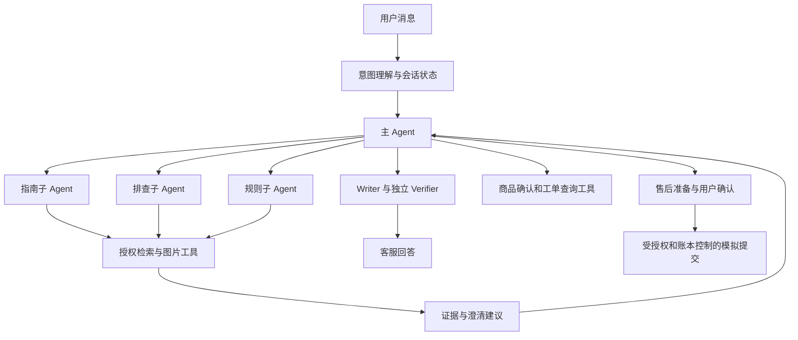

# 主从 Agent 首版

本轮在现有 AgentRunner 中加入可选委派节点，进程内运行、默认共用同一模型 gateway；不是多个部署服务，也不是宣称多个模型并行推理。人工交接继续暂停。

## 分工

| 角色 | 职责 | 可执行工具 |
|---|---|---|
| 主 Agent | 维护诉求、决定是否委派、处理澄清、控制最终答复和业务流程 | 原有授权工具和 delegate |
| guide | 查找操作、安装步骤及对应原图 | search_manuals/read_page/inspect_asset |
| troubleshoot | 根据现象与失败尝试补查证据，提出必要问题 | 上述工具及 inspect_user_image |
| policy | 查找适用规则，明确缺少的政策依据 | search_manuals/read_page |

商品确认与工单查询是确定性工具，现阶段不额外包装成子 Agent；售后准备/提交只能由主控发起并经过原确认规则。子 Agent 无业务写操作、商品选择、再次委派或对用户直接输出的权限。能力白名单由程序校验，不只写在提示中。

## 调度、状态与预算

PlanDecision 新增 delegate、specialist、task；主控只有在商品已选定、委派启用、任务明确时才能委派。每轮最多 2 次委派，每次最多 2 次子 Agent 决策；查图产生的模型调用也记入同一 MeteredGateway。保留至少一次主控决策和 Writer/Verifier 预算，额度不足时返回预算不足报告，不新建子预算。

子 Agent 的指令、工具目录、返回契约独立；其局部循环选择只读工具、done 或建议 clarify。证据必须经既有工具授权并登记后进入共享上下文。返回报告只含执行状态、调用数、实际新增证据 ID 和建议追问；它不是来源证据，也不自动代表用户任务完成。主控决定下一步，最终文本仍走原核验。

委派状态、待执行只读工具及计数进入 AgentState/会话 checkpoint；中断后可以继续待执行工具。工具调用仍走原账本和作用域检查。失败返回主控；全局取消/预算终止仍停止整轮。记录 specialist.delegated / specialist.completed 事件与模型 role；子 Agent 报告本身不作为真实性能结果。

运行配置记录启用标志、specialists-v2、角色指令和工具白名单 hash，主提示为 agent-v7。真实 Agent 默认启用，主控可选择直接工具；固定基线控制器及旧 fake fixture 默认不启用。宿主可传 delegation_enabled=False 做对照，或在测试中显式启用。新配置与旧未完成 run 不兼容时沿用既有配置变化拒绝策略，不悄悄改写旧实验。

## 验证与边界

新增测试检查委派→只读检索→主控→独立核验、禁止子 Agent 调用提交工具、规则子 Agent 禁止读用户图片、小预算保留，以及委派决策保存后中断/恢复不重复检索。原 Agent 与工单查询继续回归。本轮未调用真实模型，累计预算不增加。

这不是全量效果验收。尚未完成真实路由选择/收益评测、完整主从协作场景评测、多诉求结果统一汇总、跨轮长期排查记忆和专属 UI 展示。当前顺序委派，不并发修改共享状态；不新增专家递归或无限工具循环。证据与测试记录见 artifacts/shopguide/specialists-tests.xml 和 specialists-final-tests.xml。

最终检查：原 Agent/工单与初版主从共 32 项回归通过；补充中断恢复与最终配置后，主从专项 5 项通过。两个集合有重叠，不相加宣传独立测试总数。Ruff/Mypy 通过，未新增真实请求。

## 第二轮：诉求绑定与协作衔接

主从结构作为确定的产品架构保留。本轮完善其实际分工与可靠性，不将是否采用它重新设为决策门槛，也不据架构本身声称效果提升。

- PlanDecision 的 delegate 增加 goal_id。有意图状态时，程序要求该目标 active/current，且对应指南、排查、规则咨询的角色映射正确；暂停、撤回、非当前目标不能委派。没有意图状态的兼容路径仍可按任务委派。
- 同轮对同一 goal/角色/归一化任务的重复委派被拒绝；两次总委派上限不变。失败后主控可改用直接工具或提出澄清，不自动反复调用同一子 Agent。
- 子 Agent 可返回已经登记的 evidence_ids。以前只记录新增证据，会把复用现有资料的工作记成空结果；现在复用引用先校验当前作用域，与新检索证据去重汇总。任意未知证据仍拒绝。
- 子 Agent 失败返回受控 failure_reason，保留已有合法证据；主控回收执行权。报告表示证据收集或失败，不自动标记用户诉求完成。
- 工单查询结果单独保存在 collected_service_query。如果意图状态还有其他 active/current 诉求，查完工单后继续主控流程；最终 answer、澄清或失败结果都可同时带上已完成的查询记录，不因某一部分失败抹掉真实查询结果。
- 主控输入明确告知已有查询结果，避免重复查询。原工具重复次数和总预算仍是硬限制。

范围限制：本轮完成“查询工单 + 其他问答”的衔接，并非任意多业务结果的通用聚合器；只有已接入意图状态才能程序化判断其他诉求。目标是否真正解决仍须回答核验与后续用户反馈，不能把 active 自动批量改成完成。没有新增并行写状态、人工交接或额外调用额度。

验证工件：artifacts/shopguide/supervisor-v2-tests.xml、supervisor-v2-agent-api.xml。本轮无真实模型调用，生产模型的委派准确性、长期多轮协作仍未完成效果验收。

第二轮最终验证：意图/委派/查询专项 24 项通过，原 Agent/API 回归 33 项通过；补强失败后回收断言后，主从专项 10 项再次通过（与前述集合重叠，不重复计数）。Ruff/Mypy 通过。无新增真实模型请求。

真实模型后续验证已执行：13 次请求，纯工单查询通过，显式指南委派发生但混合任务最终核验失败；累计 867/870。见 [真实验证记录](supervisor_real_validation.md)。先前“本轮无真实请求”指对应工程阶段，不代表当前从未测试。

后续修复：业务查询结果已传入最终回答/核验，定向两请求真实复验通过，累计 869/870。见 [修复记录](business_context_repair.md)；上文原失败作为历史证据保留。
